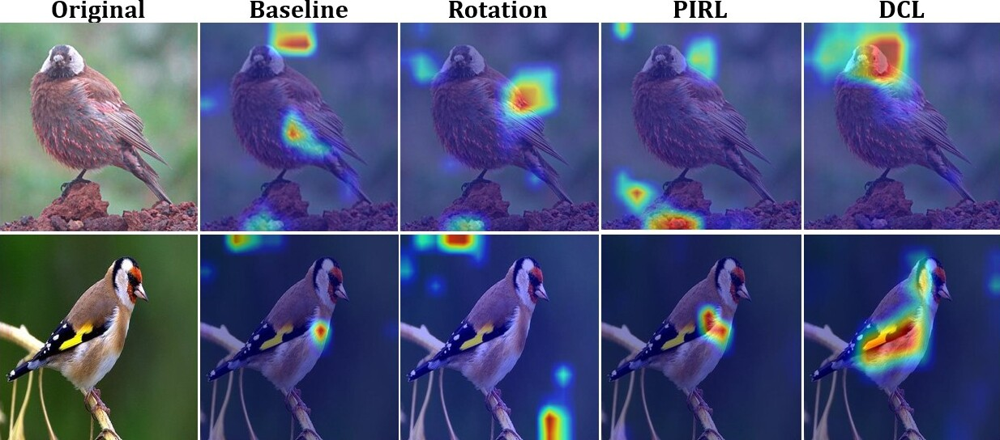
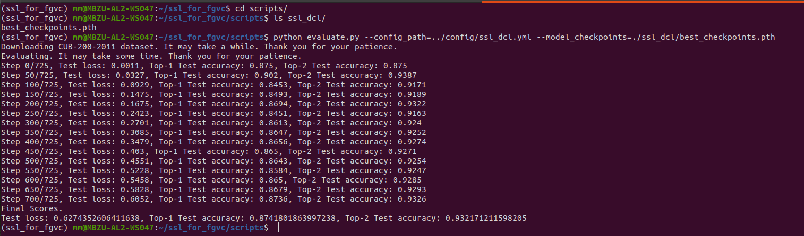

# Self-Supervised Learning for Fine Grained Image Categorization

The repository contains the implementation of adding self-supervision as an auxiliary task to the baseline model for  fine-grained visual categorization (FGVC) task. 
Specifically, it provides the implementation for rotation, pretext invariant representation learning (PIRL) and destruction and construction learning (DCL) 
as auxiliary tasks for the baseline model.



## Available Models
The list of implemented model architectures can be found at [here](model/README.md).

## Pipeline Configuration
All the functionalities of this repository can be accessed using a `.yml` configuration file. 
The details related to the configuration parameters can be found at [here]().

We also provide sample configuration files at `./config/*` for each implemented method as listed below.
1. [Baseline Config](config/baseline.yml)
1. [SSL Rotation Config](config/ssl_rotation.yml)
1. [SSL PIRL Config](config/ssl_pirl.yml)
1. [SSL DCL Config](config/ssl_dcl.yml)

## Dependencies
* Ubuntu based machine with NVIDIA GPU is required to run the training and evaluation. The code has been developed on a machine having Ubuntu 18.04 LTS distribution with one 24GB Quadro RTX 6000 GPU. 
* Python 3.8.
* Pytorch 1.7.1 and corresponding torchvision version.

## Installation
It is recommended to create a new conda environment for this project. The installation steps are as follows:
1. Create new conda environment and activate it.
```bash
$ conda create env --name=ssl_for_fgvc python=3.8
$ conda activate ssl_for_fgvc
```
2. Install requirements as,
```bash
$ pip install -r requirements.txt
```

## Evaluating Pretrained Models
All the pretrained models can be found at [click_me](https://mbzuaiac-my.sharepoint.com/:f:/g/personal/20020063_mbzuai_ac_ae/EtMbK1h75NhPmvr4L_xANoABklXEyadRsBPHSfI8I9jhlA?e=JEuXy3). 
In order to evaluate a model, download the model 
checkpoints from the link and use `scripts/evaluate.py` script for evaluating the model on the test set.

```bash
$ cd scripts
$ python evaluate.py --config_path=<path to the corresponding configuration '.yml' file.> \
--model_checkpoints=<path to the downloaded model checkpoints> \
--root_dataset_path=<path to the dataset root directory>
```
If the `--root_dataset_path` command line parameter has not been provided to `evaluate.py` script, it will download the dataset 
and perform the testing. The downloading of data may take some time based on the network stability and speed. For more information run,
```bash
$ python evaluate.py --help
```

### Sample Input and Expected Output
For example, in order to evaluate the DCL model, download the corresponding checkpoints 
(let's say in the `scripts` directory as `ssl_dcl/best_checkpoints.pth`) 
and run the following commands.

```bash
$ cd scripts
$ python evaluate.py --config_path=../config/ssl_dcl.yml --model_checkpoints=./ssl_dcl/best_checkpoints.pth
```
The expected outputs after running the command are given below.



## Training Models from Scratch
The end-to-end training functionality can be accessed using the [`main.py`](main.py) script. 
The script takes pipeline config (`.yml`) file as command line parameter and initiates the corresponding training. 

```bash
$ python main.py --config_path=<path to the corresponding configuration '.yml' file.>
```
For more information run,
```bash
$ python main.py --help
```
### Sample Input and Expected Output
For example, to train a DCL model run,
```
$ python main.py --config_path=./config/ssl_dcl.yml
```
The expected outputs after running the command are given below.


## CAM Visualization
The repository also provides the functionality to generate class activation maps (CAMs) 
for the trained model on the whole test dataset. The script [`scripts/cam_visualizations.py`](scripts/cam_visualizations.py) 
exposes this functionality. Run the following commands to generate CAMs for the trained model.
```bash
$ cd scripts
$ python cam_visualizations.py --config_path=<path to the corresponding configuration '.yml' file.> \
--model_checkpoints=<path to the downloaded model checkpoints> \
--root_dataset_path=<path to the dataset root directory> \
--output_directory=<path to ouput directory to save the visualizations>
```
If the parameter `--root_dataset_path` is not provided, the program will automatically download the dataset 
and generate the visualizations. For more information run,
```bash
$ python cam_visualizations.py --help
```

## Docker
We also provide [`Dockerfile`](Dockerfile) for containerization and [`docker-compose.yml`](docker-compose.yml) file for running the training as service.

Follow the below steps to run the training as a service,

1. Install docker dependencies using [install_docker_dependencies.sh](scripts/install_docker_dependencies.sh).
```bash
$ cd scripts
$ bash install_docker_dependencies.sh
```
2. Create docker image by running the following command from the root repository directory,
```bash
$ docker build -t ssl_for_fgvc:v1.0
```
Where `ssl_for_fgvc:v1.0` is the docker image name.

3. Run the training as docker-compose service by running,
```bash
$ docker-compose up -d
```
4. View the training logs by running,
```
$ docker-compose logs -f ssl_for_fgvc
```