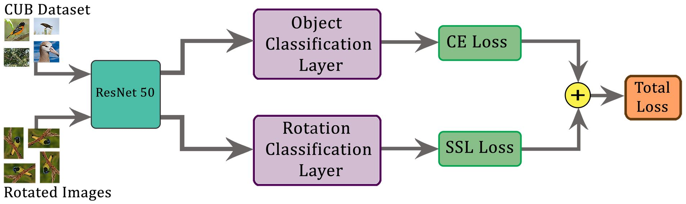
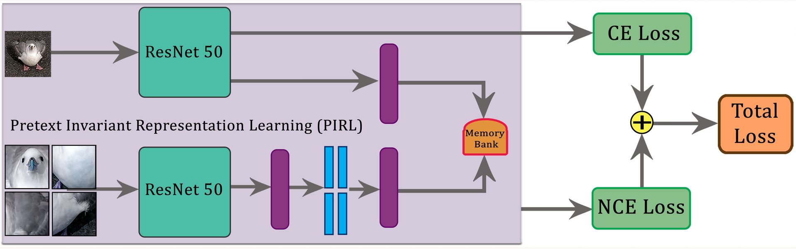
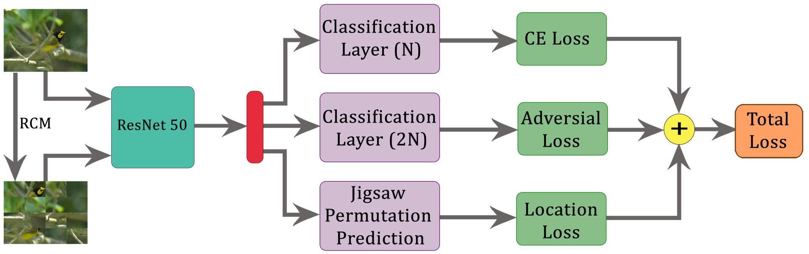

# Models 

The project explores three different self supervised auxiliary tasks for
the fine-grained classification problem: Rotation, pretext invariant 
representation learning (PIRL) and Deconstruction and Construction Learning (DCL).
The models for each of SSL tasks are defined in this [model directory](../model).
The project uses a parallel pipeline for all the SSL implementation, where each
model is trained end-end with a combination of classification loss and SSL loss,
inspired from [1].

## Rotation as Auxiliary task
Random rotations of multiples of 90 degree as used as pretext augmentations [1].
The classification head of the model predicts the CUB classes, and the rotation 
head predicts the  random rotation. The The total loss is a combination of the
classification and rotation loss. A [pre-process](../utils/rotation_utils.py)
function applies rotation augmentations and auto generates corresponding labels.
The rotation model architecture is defined in two ways.
[SSL rotation](torchvision_ssl_rotation.py) defines a model with two classification
heads with a standard ResNet-50 backbone. [FGVC rotation](fgvc_ssl_rotation.py) 
additionaly uses a [diversification block](../layers/diversification_block.py) [2]
in the architecture. Both models are trained with [rotation trainer](../train/ssl_rot_trainer.py) and uses
the [rotation config](config/ssl_rotation.yml).

## PIRL

PIRL[3] learns transformation-invariant representations. Representations are learned from the original image
and [jigsaw patches](../transforms/pirl.py) of the input image through a backbone, using the defined
[PIRL model](torchvision_ssl_pirl.py). A [pirl trainer](/train/ssl_pirl_trainer.py)
is defined to train with constrastive loss, computed these two representations
as a positive pair, and representations in the memory bank as negative samples.
The configuration can be found [here](config/ssl_pirl.yml).

## Deconstruction and Construction Learning (DCL)

DCL[4] helps in learning local discriminating features. The deconstruction learning forces the model to focus
on local object parts, while reconstruction learning helps in learning the correlation between the parts.
Images are carefully deconstructed into uniform patches sand shuffled in jigsaw pattern using a
[region confusion mechanism](../transforms/dcl.py). The defined [model](torchvision_ssl_dcl.py) learns 
to predict the classes from the jigsaw images trained with classification loss.
An adversarial loss helps model distinguish original images from deconstructed images. 
The model learns to reconstruct the image using a location loss. The model is trained with a combination
of all three loss, and uses the defined [dcl trainer](../train/dcl_trainer.py) with the corresponding
[dcl configuration](config/ssl_dcl.yml).
 
 
 
### References
[1] Gidaris, Spyros, et al. "Boosting few-shot visual learning with self-supervision."\
[2] Misra, Ishan, and Laurens van der Maaten. "Self-supervised learning of pretext-invariant representations."\
[3] Sun, Guolei, et al. "Fine-grained recognition: Accounting for subtle differences between similar classes."\
[4] Chen, Yue, et al. "Destruction and construction learning for fine-grained image recognition." \
